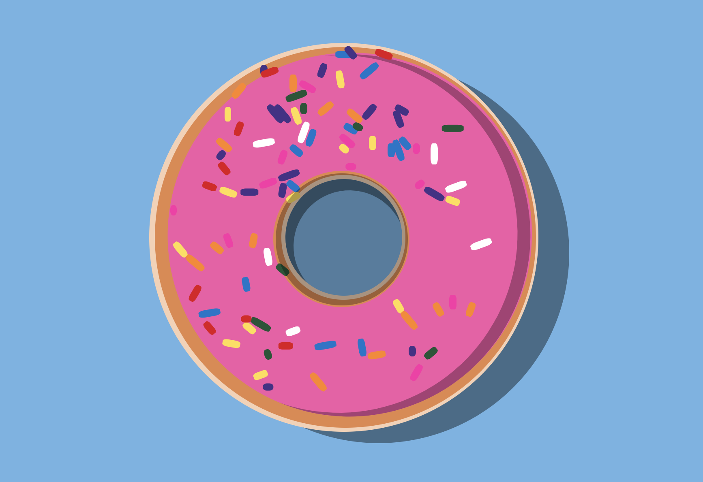

# Pure CSS (+ JavaScript) Challenge: Donut with Sprinkles

November 13-14, 2018 | Decided to practice CSS Animations and Javascipt

When you press the "Add Sprinkles" button, there are sprinkles dropped onto the donut

## Other Pure CSS Images
* https://github.com/pennmeg/pure_css_desk-flatlay
* https://github.com/pennmeg/pure_css_pixel_heart
* https://github.com/pennmeg/pure_css_image
* https://github.com/pennmeg/pure_css_laptop
* https://github.com/pennmeg/pure_css_pug
* https://github.com/pennmeg/pure_css_tayles
* https://github.com/pennmeg/pure_css_cat
* https://github.com/pennmeg/pure_css_duck
* https://github.com/pennmeg/pure_css_ocanada
* https://github.com/pennmeg/pure_css_corgi
* https://github.com/pennmeg/pure_css_space_giraffe
